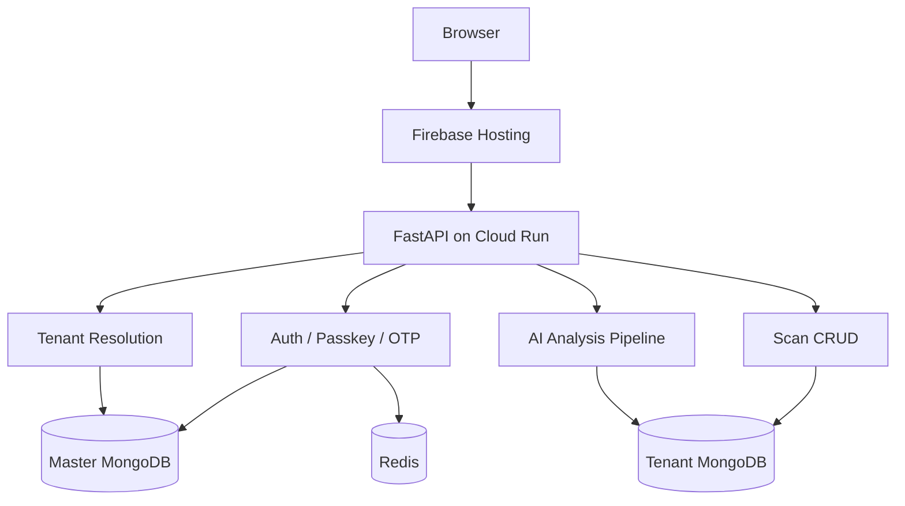

# ThoraxAI

ThoraxAI is a multi-tenant chest X-ray analysis platform. Hospitals get isolated tenant data, doctors upload scans and run AI analysis, and the backend returns both a prediction and an explainability heatmap.

## What Is Included

- React SPA for authentication, patient management, scan upload, and result review
- FastAPI backend for auth, tenants, scans, and AI analysis
- PyTorch-based chest X-ray inference with Grad-CAM overlays
- MongoDB for persistent data and Redis for auth/rate-limit state
- Docker, Terraform, Cloud Run, and Firebase Hosting for deployment

## Architecture



## Tech Stack

- Backend: FastAPI, Motor, Redis, PyTorch, torchvision, OpenCV
- Frontend: React 19, Vite 7, Tailwind CSS 4, React Router
- Deployment: Docker, Google Cloud Run, Firebase Hosting, Terraform
- Auth: JWT, OTP email flows, WebAuthn passkeys

## Repository Layout

```text
backend/     FastAPI app, AI pipeline, middleware, services, Dockerfile
frontend/    React SPA, API client, pages, components, Firebase config
terraform/   GCP infrastructure for Cloud Run, Secret Manager, storage, Firebase
.manuals/    Full project manual and deployment guide
```

## Local Setup

### Backend

```bash
cd backend
python -m venv .venv
.venv\Scripts\activate
pip install -r requirements.txt
uvicorn main:app --reload --port 8000
```

### Frontend

```bash
cd frontend
npm install
npm run dev
```

The frontend reads `VITE_API_BASE_URL` from `frontend/.env` or `frontend/.env.production`.

## Environment Variables

Backend examples live in `backend/.env.example`. The important values are:

- `DATABASE_URL`
- `REDIS_URL`
- `JWT_SECRET_KEY`
- `HF_TOKEN`
- `HF_MODEL_REPO`
- `GROQ_API_KEY`

Frontend examples live in `frontend/.env.example` and production values live in `frontend/.env.production`.

## AI Pipeline

1. Preprocess the X-ray image.
2. Load the body-part model checkpoint.
3. Run inference to produce prediction and confidence.
4. Generate a Grad-CAM heatmap.
5. Optionally rewrite the result with the LLM fallback path.
6. Persist the result back to the tenant scan record.

## Production Deployment

- Backend: Google Cloud Run
- Frontend: Firebase Hosting
- Infrastructure: Terraform in `terraform/main.tf`

For the full setup and deployment flow, see [`.manuals/index.html`](.manuals/index.html).

## Useful Commands

### Backend

```bash
python -m ruff check backend/routes/ai/inference.py
```

### Frontend

```bash
npm run lint
npm run build
```

### Terraform

```bash
cd terraform
terraform validate
```

## Notes

- Runtime uploads, Terraform state, model weights, and build output are intentionally not tracked in source control.
- The production deployment currently uses a higher-memory Cloud Run configuration because inference is memory intensive.

